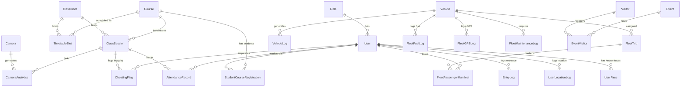

# 🤖 Smart Campus System - Comprehensive Technical Features Guide
**System Version**: 2.5.0-Enterprise  
**Technical Standards Compliance**: ISO/IEC 27001 (Security), GDPR / Kenya Data Protection Act 2019  
**Core Frameworks**: FastAPI (Python 3.10+), React (TypeScript 5.0+), SQLModel (SQLAlchemy & Pydantic), PostgreSQL (v15+)  

---

## 📍 System Architecture Overview

The **Smart Campus System** is built on a highly scalable, containerized microservices architecture. It combines real-time data ingestion pipelines, advanced Artificial Intelligence (Computer Vision, Optical Character Recognition, Face Recognition), and role-based operational modules into a single, unified enterprise application. 

```
               [ FRONTEND: React Single Page Application (Vite + TS) ]
                                      │  (HTTP / WebSocket Streams)
                                      ▼
             [ BACKEND CORE: FastAPI (Python Async REST API Server) ]
                                      │
         ┌────────────────────────────┼───────────────────────────┐
         ▼                            ▼                           ▼
[ RELATIONAL DATABASE ]     [ AI MICROSERVICES ]        [ SCHEDULERS & WORKERS ]
PostgreSQL (v15+)           - AWS Rekognition           - Background Tasks
- SQLModel Schema           - Google Vision API         - Daily Email Reports
- pgvector Embeddings       - self-hosted DeepStack     - Camera Health Pollers
                            - OpenCV (Frame Capture)    - SMS Alert Gateways
```

---

## 📂 Section 1: Core Technical Modules & Capabilities

The following catalog provides a technical breakdown of all 20+ functional sub-modules and pages implemented in the Smart Campus System.

---

### 1. Command Center & Dynamic Dashboard Customizer (`AdminDashboard.tsx` & `DashboardCustomizer.tsx`)
- **Real-Time Data Ingest**: Pulls live campus stats, ongoing class counts, security status, and active occupancy rates via async polling.
- **Dynamic Layout Configurator**: Implement drag-and-drop workspace layouts for SuperAdmins. Enables toggling, resizing, and rearranging widgets (Live CCTV feeds, quick forms, audit maps) using an in-memory grid-state manager synced to local browser configuration profiles.
- **Visual Analytics Core**: High-fidelity charts rendering peak hourly vehicle flows, attendance compliance trends, and room utilization percentages.

---

### 2. User Profiles & Directory System (`Users.tsx`)
- **Unified Identity Registry**: A searchable directory of students, academic staff (lecturers), security guards, parents/guardians, and admins.
- **Biometric Photo Mapping**: Simulates/integrates simultaneous text metadata collection and profile picture uploading.
- **Role Control**: Direct database role modifications, status suspension controls (instantly denying gate access), and security credential resets.

---

### 3. Guided Smart Ingestion Engine (`BulkUpload.tsx`)
- **Relational Sequence Uploads**: Guided step-by-step pipeline ensuring relational data is uploaded in strict sequence to prevent foreign-key violations.
- **Error-Logging Interface**: Identifies parsing errors in CSV rows, mismatched emails, or invalid building codes, and displays real-time debugging logs instead of generic failure notices.
- **Smart Photo Renaming & ZIP Processing**: Accepts bulk profile images zipped. Extracts, checks mappings against CSV Admission Numbers, generates secure UUID filenames, and updates the database profiles asynchronously.

---

### 4. Gate Control, Scanners & Biometrics (`GateControl.tsx`)
- **Biometric Face Verification**: Captures web camera frames, calculates facial embeddings, and compares them against `UserFace` tables.
- **High-Speed QR Card Scans**: Scans dynamic Student Digital IDs, decrypting the secure token containing the admission code to confirm active status.
- **Instant Gate Action Logs**: Log entries in `EntryLog` and `GateScanLog` recording photo snapshots, verification metrics, gate IDs, and timestamp data.
- **Panic Broadcast Alert**: Trigger-lock button that flashes alerts across all active security panels and fires high-priority SMS alerts to security dispatchers.

---

### 5. Smart Verification Terminal (`StudentVerification.tsx`)
- **Side-by-Side Visual Review**: Displays the scanned student's registered face profile against their real-time camera capture.
- **Timetable Check Engine**: Cross-checks the student's admission code against scheduled `TimetableSlot` rows to confirm where they should be at the current hour.
- **Manual Security Controls**: Allows security guards to temporarily bypass restrictions (e.g., forgotten physical badges, late arrivals due to transport).

---

### 6. Visitor Registry & Guest Logging (`VisitorManagement.tsx`)
- **Guest Ingress Workflow**: Registers external guests with details including Name, National ID/Passport number, and Phone.
- **Host Linkage**: Links guests to active student or staff member records.
- **Dynamic Watchlist Alerts**: Screens ID numbers against blacklisted records to prevent security risks.

---

### 7. Vehicle Intelligence & ALPR (OCR) (`VehicleIntel.tsx`)
- **Automatic License Plate Recognition (ALPR)**: Employs OCR algorithms to read license plates.
- **Ownership Verification**: Flags whether the vehicle is Registered (Staff/Student), Guest, or Flagged (Blacklisted).
- **Visual Vehicle Timelines**: Displays timelines of entries accompanied by their captured camera frame snapshots.

---

### 8. Academic Scheduler & Timetabling (`Timetable.tsx`)
- **Visual Timetable Grid**: 7-day visual calendar grid (Monday-Sunday) detailing all scheduled academic activities.
- **Algorithmic Conflict Detection**: The scheduling engine checks for overlapping times, room availability, and lecturer assignments. If a conflict occurs, it blocks saving and displays detailed error logs describing the conflict.

---

### 9. Classroom Directory & Asset Manager (`ClassroomManagement.tsx`)
- **Facility Resource Records**: Tracks classrooms, auditorium locations, and seating capacities.
- **Amenities Registry**: Tracks assets such as projectors, sound systems, whiteboards, air conditioning, and lab equipment.
- **Operational Status Toggles**: Block schedules by setting room status to "Maintenance" or "Reserved".

---

### 10. Live Academic Session Tracker (`LiveClasses.tsx`)
- **Ongoing Class Monitor**: Real-time monitor tracking currently running class sessions, room occupancies, and lecturer check-in statuses.
- **Ad-Hoc Session Launcher**: Launch unscheduled classes or exams instantly.
- **Student Density Analytics**: Measures actual attendance against room capacities, highlighting overcrowded rooms.

---

### 11. Class Attendance & QR Gateways (`Attendance.tsx`)
- **Dynamic QR Code Generation**: Generates secure, changing QR codes. Students scan this code to mark attendance.
- **Biometric Presence Capture**: Biometric face scans in classrooms automatically mark recognized students present in the attendance log.
- **Manual Registrar Matrix**: A grid layout allowing lecturers to mark *Present*, *Absent*, or *Excused* with a single tap.

---

### 12. Exam Proctoring & Integrity Flags (`Attendance.tsx` / `models.py`)
- **Cheating Incident Log**: Allows proctors or integrated AI engines to log integrity flags (e.g., unauthorized devices, communication).
- **Incident Documentation**: Tracks confidence scores (0-100%), descriptive notes, and links image/document evidence.

---

### 13. CCTV IP Camera Grid (`CameraMonitoring.tsx`)
- **Multi-Brand Integration**: Generates RTSP stream URLs based on camera brand (Hikvision, Dahua, Axis Communications, or Generic).
- **Analytical Grid Display**: Visual status indicators displaying online/offline connection states and diagnostic logs.
- **Test Streaming Utility**: Instant RTSP handshake testing utility to verify connection before saving cameras.

---

### 14. AI Computer Vision Control Center (`AISettings.tsx`)
- **Multi-Provider Configuration**: Setup connection details for OpenAI GPT-4 Vision, AWS Rekognition, Google Cloud Vision, Azure Computer Vision, and self-hosted DeepStack.
- **Sensitivities Adjuster**: Fine-tune motion detection sensitivity (1-100), crowd counting thresholds, and face recognition confidence parameters.
- **SMTP & SMS Alert Dispatch**: Assign emergency alert contacts to notify when capacity thresholds are breached or motion is detected after hours.

---

### 15. Fleet Transport Command Center (`FleetManagement.tsx`)
- **Comprehensive Fleet Manager**: A dual-level tab dashboard managing campus logistics:
  - **Dashboard**: Real-time transit summaries, active vehicle counts, total fuel consumption, and overdue service alerts.
  - **Vehicles Directory**: Profiles of buses and security vehicles, tracking operational states.
  - **GPS Live Tracking**: Renders real-time coordinates mapped from `FleetGPSLog`.
  - **Transit Trips Manager**: Schedules starting points, destinations, drivers, routes, and vehicles.
  - **Passenger Manifest**: Scans digital IDs of student/staff passengers to generate manifests before transit.
  - **Fuel Analytics**: Logs refueling details. Calculates fuel efficiency metrics (km/L) and projects monthly budget charts.
  - **Maintenance Center**: Tracks repair histories, parts replaced, and costs. Sets alerts for routine maintenance.
  - **Crew & Driver Registry**: Tracks driver licenses and emergency details.

---

### 16. Geofencing & Boundary Alarms (`Geofencing.tsx`)
- **Interactive Boundary Builder**: Draws virtual polygons around campus perimeters or restricted areas.
- **Breach Alert Pipeline**: Cross-references coordinates from `UserLocationLog` to trigger alarms upon unauthorized entry or exit.

---

### 17. High-Fidelity ID Card Printer (`IDPrinting.tsx`)
- **Drag-and-Drop Badge Designer**: Visual canvas to design school ID templates.
- **Automatic Branding Sync**: Synchronizes card designs with institutional logos and colors defined in settings.
- **Mass PDF Printing Engine**: Compiles selected student/staff badges into a print-ready PDF formatted for thermal ID printers.

---

### 18. Integrations & Single Sign-On (`Integrations.tsx`)
- **Google OAuth 2.0**: Setup Developer Client ID and secret keys to enable institutional email login.
- **Active Directory/LDAP**: Centralized directory service settings with connection testing tools.
- **Third-Party API Integrations**: Configure SMS alert gateways and external Webhook endpoints.

---

### 19. Company Branding Settings (`CompanySettings.tsx`)
- **Theme Palette Builder**: Customize primary, secondary, and accent color schemes using HSL parameters.
- **Accessibility Modes**: Large touch targets, high contrast themes, and native dark mode support.
- **Institutional Identity Assets**: Upload high-resolution school crests, logos, and custom favicon assets.

---

### 20. Audit Trail & System Logs (`AuditLogs.tsx` / `ScanLogs.tsx`)
- **Immutable Log Ledger**: Complete list of security audit logs.
- **Detailed Activity Search**: Filter system modifications, login histories, configuration changes, and entry logs by user, IP, or date range.

---

## 🗄️ Section 2: Relational Database Schema Mapping

The database schema is mapped using **SQLModel** (SQLAlchemy & Pydantic). The diagram below illustrates the relationships between the core database tables:



### Core Schema Fields & Types

#### 1. `Role`
Defines role permissions.
- `id`: `UUID` (Primary Key)
- `name`: `VARCHAR(50)` (e.g., student, lecturer, security, admin)
- `description`: `VARCHAR(255)`

#### 2. `User`
Tracks identities of campus citizens.
- `id`: `UUID` (Primary Key)
- `email`: `VARCHAR(255)` (Unique)
- `hashed_password`: `VARCHAR(255)`
- `full_name`: `VARCHAR(200)`
- `admission_number`: `VARCHAR(50)` (Unique, nullable for non-students)
- `phone_number`: `VARCHAR(50)`
- `department`: `VARCHAR(100)`
- `role_id`: `UUID` (Foreign Key -> `Role`)
- `profile_image`: `VARCHAR(500)` (Nullable)
- `status`: `VARCHAR(50)` (active, suspended, warning)
- `is_active`: `BOOLEAN`

#### 3. `UserFace`
Stores face recognition metadata.
- `id`: `UUID` (Primary Key)
- `user_id`: `UUID` (Foreign Key -> `User`)
- `face_embeddings`: `TEXT` (JSON array of facial vectors)
- `image_path`: `VARCHAR(500)`

#### 4. `UserLocationLog`
Geofencing tracking coordinates.
- `id`: `UUID` (Primary Key)
- `user_id`: `UUID` (Foreign Key -> `User`)
- `latitude`: `FLOAT`
- `longitude`: `FLOAT`
- `timestamp`: `DATETIME`
- `is_inside_bounds`: `BOOLEAN`

#### 5. `Classroom`
Defines room capabilities.
- `id`: `UUID` (Primary Key)
- `room_code`: `VARCHAR(50)` (Unique)
- `room_name`: `VARCHAR(100)`
- `building`: `VARCHAR(100)`
- `floor`: `INT`
- `capacity`: `INT`
- `room_type`: `VARCHAR(50)` (lecture_hall, lab, seminar_room, auditorium)
- `amenities`: `JSON` (projector, smartboard, computers, ac)
- `status`: `VARCHAR(50)` (available, maintenance, reserved)

#### 6. `Course`
Tracks academic course catalog.
- `id`: `UUID` (Primary Key)
- `course_code`: `VARCHAR(50)` (Unique)
- `course_name`: `VARCHAR(200)`
- `department`: `VARCHAR(100)`
- `credits`: `INT`
- `semester`: `VARCHAR(50)`
- `classroom_id`: `UUID` (Foreign Key -> `Classroom`, default room)
- `lecturer_id`: `UUID` (Foreign Key -> `User`, default lecturer)

#### 7. `TimetableSlot`
Weekly recurring class calendar schedules.
- `id`: `UUID` (Primary Key)
- `course_id`: `UUID` (Foreign Key -> `Course`)
- `classroom_id`: `UUID` (Foreign Key -> `Classroom`)
- `lecturer_id`: `UUID` (Foreign Key -> `User`)
- `day_of_week`: `INT` (0 = Monday, 6 = Sunday)
- `start_time`: `TIME`
- `end_time`: `TIME`
- `effective_from`: `DATE`
- `effective_until`: `DATE`
- `is_active`: `BOOLEAN`

#### 8. `ClassSession`
Specific instances of academic lectures/exams.
- `id`: `UUID` (Primary Key)
- `course_id`: `UUID` (Foreign Key -> `Course`)
- `timetable_slot_id`: `UUID` (Foreign Key -> `TimetableSlot`, Nullable for ad-hoc)
- `session_date`: `DATE`
- `start_time`: `DATETIME`
- `end_time`: `DATETIME`
- `classroom_id`: `UUID` (Foreign Key -> `Classroom`)
- `lecturer_id`: `UUID` (Foreign Key -> `User`)
- `qr_code`: `VARCHAR(500)` (Secure token string for attendance generation)
- `status`: `VARCHAR(50)` (scheduled, ongoing, completed, cancelled)

#### 9. `AttendanceRecord`
Student lecture presence records.
- `id`: `UUID` (Primary Key)
- `class_session_id`: `UUID` (Foreign Key -> `ClassSession`)
- `student_id`: `UUID` (Foreign Key -> `User`)
- `status`: `VARCHAR(50)` (present, absent, late, excused)
- `timestamp`: `DATETIME`
- `verified_by`: `VARCHAR(50)` (qr, biometric, manual)
- `device_coordinates`: `VARCHAR(100)` (Nullable)

#### 10. `CheatingFlag`
Logs academic integrity incidents.
- `id`: `UUID` (Primary Key)
- `class_session_id`: `UUID` (Foreign Key -> `ClassSession`)
- `student_id`: `UUID` (Foreign Key -> `User`)
- `flag_type`: `VARCHAR(100)` (unauthorized_device, communication, materials)
- `confidence`: `FLOAT` (AI model certainty score)
- `notes`: `TEXT`
- `timestamp`: `DATETIME`
- `image_proof_path`: `VARCHAR(500)` (Nullable)

#### 11. `Camera`
Security CCTV cameras registry.
- `id`: `UUID` (Primary Key)
- `camera_name`: `VARCHAR(200)`
- `camera_code`: `VARCHAR(50)` (Unique)
- `ip_address`: `VARCHAR(50)`
- `port`: `INT` (Default: 554)
- `username`: `VARCHAR(100)`
- `password`: `VARCHAR(255)`
- `camera_brand`: `VARCHAR(50)` (hikvision, dahua, axis, generic)
- `protocol`: `VARCHAR(20)` (rtsp, http, onvif)
- `rtsp_url`: `VARCHAR(500)`
- `classroom_id`: `UUID` (Foreign Key -> `Classroom`, Nullable)
- `status`: `VARCHAR(50)` (online, offline, error, maintenance)
- `is_active`: `BOOLEAN`
- `enable_people_counting`: `BOOLEAN`
- `enable_face_detection`: `BOOLEAN`
- `enable_motion_detection`: `BOOLEAN`
- `enable_object_detection`: `BOOLEAN`
- `last_seen`: `DATETIME`

#### 12. `CameraAnalytics`
Automated AI surveillance analytical capture logs.
- `id`: `UUID` (Primary Key)
- `camera_id`: `UUID` (Foreign Key -> `Camera`)
- `timestamp`: `DATETIME`
- `people_count`: `INT`
- `occupancy_percentage`: `FLOAT`
- `motion_level`: `VARCHAR(20)` (low, medium, high)
- `detected_objects`: `JSON` (array of detected object tags)
- `class_session_id`: `UUID` (Foreign Key -> `ClassSession`, Nullable)
- `is_alert`: `BOOLEAN`
- `alert_type`: `VARCHAR(50)`
- `alert_message`: `TEXT`

#### 13. `Vehicle`
Campus vehicle registry.
- `id`: `UUID` (Primary Key)
- `license_plate`: `VARCHAR(50)` (Unique)
- `owner_id`: `UUID` (Foreign Key -> `User`, Nullable for delivery/taxi)
- `owner_name`: `VARCHAR(200)`
- `vehicle_type`: `VARCHAR(50)` (car, bus, truck, motorcycle)
- `brand`: `VARCHAR(50)`
- `model`: `VARCHAR(50)`
- `color`: `VARCHAR(30)`
- `status`: `VARCHAR(50)` (allowed, flagged, guest)

#### 14. `VehicleLog`
Gate vehicle transition tracking logs.
- `id`: `UUID` (Primary Key)
- `vehicle_id`: `UUID` (Foreign Key -> `Vehicle`)
- `gate_id`: `UUID` (Foreign Key -> `Gate`)
- `direction`: `VARCHAR(10)` (in, out)
- `timestamp`: `DATETIME`
- `snapshot_path`: `VARCHAR(500)`
- `passenger_count`: `INT`

#### 15. `FleetTrip`
Transit logs for school buses.
- `id`: `UUID` (Primary Key)
- `vehicle_id`: `UUID` (Foreign Key -> `Vehicle`)
- `driver_id`: `UUID` (Foreign Key -> `User`)
- `route`: `VARCHAR(255)`
- `status`: `VARCHAR(50)` (scheduled, ongoing, completed, cancelled)
- `start_time`: `DATETIME`
- `end_time`: `DATETIME`

#### 16. `Visitor`
Extensive visitor management log.
- `id`: `UUID` (Primary Key)
- `full_name`: `VARCHAR(200)`
- `national_id`: `VARCHAR(50)`
- `phone_number`: `VARCHAR(50)`
- `purpose`: `VARCHAR(255)`
- `host_user_id`: `UUID` (Foreign Key -> `User`, Nullable)
- `check_in_time`: `DATETIME`
- `check_out_time`: `DATETIME` (Nullable)

---

## 🧠 Section 3: AI Core & Computer Vision Configurations

The system integrates with major Cloud and Edge AI services. The active AI engine is selected and customized globally in `/ai-settings`.

### 1. OpenAI (GPT-4 Vision)
- **Use Case**: Advanced scene understanding, license plate OCR, and context anomaly detection.
- **Process**: Captures JPEG image buffers from cameras, posts them to OpenAI vision APIs, and parses JSON output describing scene contents, license characters, or suspicious anomalies.

### 2. Google Cloud Vision
- **Use Case**: Crowd density people counting, standard label detection, and OCR.
- **Process**: High-speed REST calls processing image buffers to return bounding boxes of `Person` objects, counting total detections, and logging occupancy levels.

### 3. AWS Rekognition
- **Use Case**: Biometric face detection, multi-face comparison, and security watchlists.
- **Process**: Generates 128-dimensional facial embedding vectors from images. Matches them against pre-indexed facial collections.

### 4. DeepStack (Self-Hosted Edge AI)
- **Use Case**: Local deployment. Face recognition and object/motion detection without cloud dependency.
- **Process**: Local Docker container endpoint (`http://localhost:5000/v1/vision/face/recognize`). Handles image inputs locally, ensuring data compliance and zero API usage fees.

---

## ⏰ Section 4: Automated Processes & Communication Protocols

### 📬 1. Daily Reports Automation Scheduler (`scheduler.py`)
```
[ Trigger: Daily at 18:00 (6:00 PM) ]
                  │
                  ▼
[ Fetch all Class Sessions completed "Today" ]
                  │
                  ▼
[ For each Session: Compile Present/Absent/Late logs into CSV ]
                  │
                  ▼
[ Fetch Lecturer Email -> Compose Email Attachment ]
                  │
                  ▼
[ Send Email via secure SMTP Gateway (SSL/TLS Port 587) ]
```

- **Execution Engine**: Asynchronous loop running within FastAPI.
- **Report Contents**: Compiles all attendance records for a course session into a detailed CSV attachment including: `Admission Number`, `Student Name`, `Class Date`, `Time Scanned`, `Method (QR/Face/Manual)`, and `Attendance Status`.
- **System Feedback Alerts**: The mailer validates lecturer emails before queuing, logging clear warning alerts in backend consoles if SMTP connections timeout or email addresses are missing.

### 📱 2. SMS Alerts & Guardian Dispatch Gateway
- **Event Triggers**: Alerts are sent on specific events:
  - *Student Location Boundary Violation* (leaves campus during school hours).
  - *Emergency Panic Alarm* triggered at gate checkpoints.
  - *Unauthorized Restricted Area Ingress*.
- **API Interface**: Standard SMS gateways (e.g., Africa's Talking API) are integrated via webhooks to deliver immediate text messages to guardians and security personnel.

---

## 🎨 Section 5: Design Systems & Aesthetic Control

In alignment with accessibility guidelines, the front-end styling implements a modern design language:
- **Harmonious Palettes**: Calming, healthcare-inspired HSL parameters are used (e.g., slate/emerald primary tones, avoiding flat or default colors).
- **Responsive Fluidity**: Adaptive layouts dynamically scaling from vertical student smartphone screen sizes up to security monitor grids.
- **Micro-Animations & Hover Responses**: Provides clean visual feedback on every button click, scan result, and menu transition.
- **High-Contrast Dark Theme**: Readable dark mode utilizing HSL text contrast overrides for enhanced visibility at night checkpoints.

---
**Technical Operations Standard Manual**  
*KKDES Technical Systems Division*
