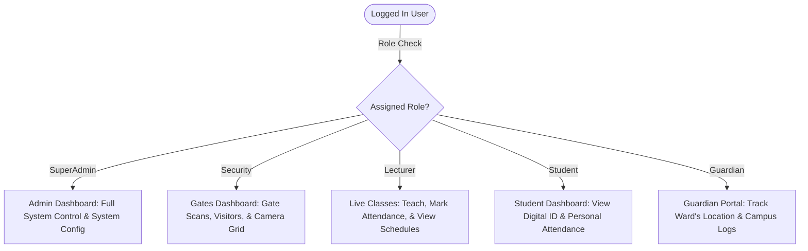
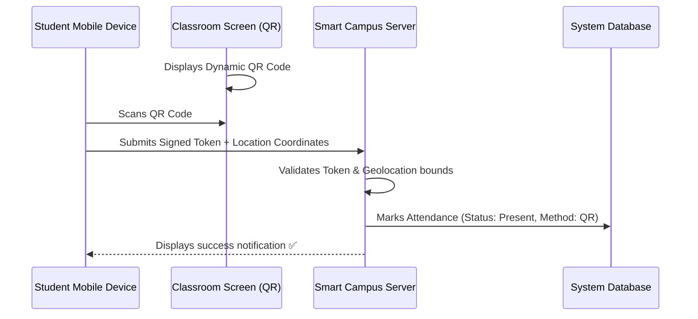

# 🏫 Smart Campus System - Comprehensive User Guide
**Version**: 2.5.0 (Enterprise Smart Campus)  
**Author**: KKDES Technical Solutions  
**Support**: support@kkdes.co.ke | +254 700 448 448  

---

Welcome to the **Smart Campus System**, an advanced, unified web application designed to secure, digitize, and automate your institution's operations. Driven by next-generation artificial intelligence, real-time Computer Vision, and highly interactive modules, this platform handles campus security, identity authentication, academic operations, and logistics from a centralized, beautiful dashboard.

This user guide is written to help administrators, security personnel, academic staff, students, and guardians fully leverage the platform's extensive capabilities.

---

## 📚 Table of Contents
1. [🔐 Access Control & Role-Based Portals](#1-access-control--role-based-portals)
2. [📊 Command Center & Custom Dashboards](#2-command-center--custom-dashboards)
3. [🚀 Smart Setup & Bulk Data Ingestion](#3-smart-setup--bulk-data-ingestion)
4. [🚧 Gate Control & Biometric Identity Verification](#4-gate-control--biometric-identity-verification)
5. [📅 Academic Management & Attendance Automation](#5-academic-management--attendance-automation)
6. [🎥 CCTV IP Camera Surveillance & AI Analytics](#6-cctv-ip-camera-surveillance--ai-analytics)
7. [🚌 Fleet Logistics & Transportation Management](#7-fleet-logistics--transportation-management)
8. [🗺️ Geofencing & Safety Zoning](#8-geofencing--safety-zoning)
9. [🖨️ ID Badge Designer & Printing Studio](#9-id-badge-designer--printing-studio)
10. [⚙️ System Customization & Automated Reporting](#10-system-customization--automated-reporting)

---

## 🔐 1. Access Control & Role-Based Portals <a name="1-access-control--role-based-portals"></a>

The Smart Campus System uses a highly secure, role-based database authentication system. The interface, sidebar options, and API endpoint accesses dynamically modify themselves depending on the role assigned to the logged-in user.

### Logging In
1. Open your web browser and navigate to the application URL: `http://localhost:5173` (or your dedicated production domain).
2. Enter your **Admission Number** or **Registered Email Address** and your secure **Password**.
3. **Google SSO**: If Google SSO is configured for your domain, click the **"Sign in with Google"** button to automatically log in using your institutional email address.
4. **LDAP/Active Directory**: In corporate or enterprise school networks, check the "LDAP Login" option to verify your credentials directly against the central Active Directory service.

> [!NOTE]
> For security, after five (5) failed login attempts, your account will be locked temporarily for 15 minutes. Security and SuperAdmin accounts should notify IT Support if they forget their password.

### Understanding the 5 Roles



1. **SuperAdmin (Full Access)**  
   - **Default Landing**: Command Center Dashboard.
   - **Capabilities**: Complete access to user directories, database configurations, AI settings, fleet logs, financial data, third-party integrations, and advanced auditing tools.
2. **Security Personnel**  
   - **Default Landing**: Gates Dashboard.
   - **Capabilities**: Access to physical gate control scanners, manual visitor check-in, Automatic License Plate Recognition (ALPR) feeds, camera streams, and panic alarm buttons.
3. **Lecturer (Academic Staff)**  
   - **Default Landing**: Live Classes Portal.
   - **Capabilities**: View active teaching timetables, launch new class sessions, generate attendance QR codes, perform biometric face scans on students, view academic reports, and log exam cheating flags.
4. **Student**  
   - **Default Landing**: Student Mobile Portal.
   - **Capabilities**: Access their personalized high-fidelity Digital ID Card, view their daily class schedules, track personal attendance scores, and scan lecture QR codes to mark present.
5. **Guardian (Parent)**  
   - **Default Landing**: Ward Tracking Portal.
   - **Capabilities**: Track whether their ward is currently on campus, view exact entry/exit logs at gates, and receive automated email/SMS notifications of late arrivals or suspicious absences.

---

## 📊 2. Command Center & Custom Dashboards <a name="2-command-center--custom-dashboards"></a>

Upon logging in as an administrator, you enter the **Central Command Center**, which displays real-time statistics and historical analytics.

### Live Metrics & Analytics
- **Campus Occupancy**: An HSL-themed 3D progress bar indicating the exact number of students and staff currently on campus compared to maximum capacity.
- **Active Class Sessions**: Displays the number of ongoing classes, active lecturers, and current overall attendance rates.
- **Security Health Grid**: Displays connection statuses of all connected IP Cameras, database latency, and active security alerts.
- **Dynamic Charts**: Interactive traffic analysis (Recharts) showing peak gate entry hours, vehicle classification ratios, and daily attendance percentages.

### Dashboard Customization System
Admins can fully customize their command center dashboard to match their operational priorities:
1. Click the **"Customize Layout"** button at the top right of the dashboard.
2. The dashboard will enter **Edit Mode**, displaying a customizable grid.
3. **Rearrange Widgets**: Click and drag widget cards to move them.
4. **Toggle Widgets**: Use the settings panel to enable/disable widgets such as:
   - *Live Camera Feed Snapshot*
   - *Quick Registration Form*
   - *Recent Security Alerts Activity*
   - *Fleet Vehicle Status Grid*
5. Click **"Save Layout"** to write these preferences to your local browser storage.

---

## 🚀 3. Smart Setup & Bulk Data Ingestion <a name="3-smart-setup--bulk-data-ingestion"></a>

Setting up a digital campus from scratch can be tedious. Under **Settings → Data Import**, the system provides a guided, **7-Step Smart Setup Wizard** that walks you through population of the database in a logically ordered sequence to preserve relational foreign-key integrity.

```
[1. Lecturers] ➔ [2. Classrooms] ➔ [3. Courses] ➔ [4. Timetables] ➔ [5. Students] ➔ [6. Registrations] ➔ [7. ZIP Photos]
```

### The 7-Step Smart Setup Workflow

1.  **Step 1: Lecturers Registry**  
    - **Purpose**: Upload the academic staff registry.
    - **CSV Template Fields**: `full_name`, `email`, `password`, `department`, `employee_code`
2.  **Step 2: Classroom Catalog**  
    - **Purpose**: Define the physical classrooms, building structures, and floor locations.
    - **CSV Template Fields**: `room_code`, `room_name`, `building`, `floor`, `capacity`, `room_type`, `amenities_json`
3.  **Step 3: Course Curriculum**  
    - **Purpose**: Register the course syllabus and map their default rooms and lecturers.
    - **CSV Template Fields**: `course_code`, `course_name`, `department`, `credits`, `semester`, `default_classroom_code`, `lecturer_email`
4.  **Step 4: Weekly Timetable Slots**  
    - **Purpose**: Set the recurring weekly calendar of classes.
    - **CSV Template Fields**: `course_code`, `classroom_code`, `lecturer_email`, `day_of_week` (0-6), `start_time` (HH:MM), `end_time` (HH:MM)
5.  **Step 5: Student Enrollment**  
    - **Purpose**: Enroll the students into the system database.
    - **CSV Template Fields**: `admission_number`, `full_name`, `email`, `password`, `department`, `phone_number`
6.  **Step 6: Course Registrations**  
    - **Purpose**: Map students to the courses they are taking.
    - **CSV Template Fields**: `admission_number`, `course_code`
7.  **Step 7: Smart Bulk Photo Upload**  
    - **Purpose**: Batch-process high-resolution profile photos and link them automatically to the students' biometric profiles, even if camera file names don't match admission numbers.
    - **How to execute**:
      1. Download the **Photo Mapping CSV Template**.
      2. Fill out the CSV mapping:
         ```csv
         Admission Number,Photo Filename
         STD001,DSC_9012.jpg
         STD002,IMG_8432.png
         STD003,my_profile_photo.jpeg
         ```
      3. Compress all mapped image files directly into a single standard `.zip` archive.
      4. Select and upload the **Mapping CSV** first (displays green checkmark ✅).
      5. Select and upload the **ZIP Archive** next (displays green checkmark ✅).
      6. Click **"Start Bulk Photo Upload"**. The backend automatically unzips, renames the files securely using UUID hashes, writes them to `static/uploads/`, and links them in the database!

> [!WARNING]
> Keep the ZIP file size under 150MB to prevent network timeout errors on standard servers. Ensure that the filenames in your ZIP archive match your CSV mapping exactly, including capitalization and extensions (e.g., `.jpg` vs `.JPG`).

---

## 🚧 4. Gate Control & Biometric Identity Verification <a name="4-gate-control--biometric-identity-verification"></a>

The **Gate Control Dashboard** is the primary interface used by campus security officers to manage safety checkpoints.

### Gate Check-In & Scans
- **Manual Search**: Type a student's name or admission number in the quick search bar. Click **"Check In"** or **"Check Out"** to log their transitions.
- **Digital QR Scan**: Point the webcam/external USB scanner at the student's digital ID screen. The scanner instantly reads the encrypted admission token and verifies access.
- **Biometric Face Verification**: If a camera is connected, clicking **"Scan Face"** captures a real-time snapshot, matches it against registered `UserFace` embeddings via active AI services, and returns a verified identity.

### Smart Student Verification Panel
Clicking on any scanned user's profile card opens the **Deep Verification Screen**:
- **Identity Integrity Check**: Displays high-resolution face matching comparison side-by-side.
- **Academic Sync Tracker**: Displays the student's active class session according to the timetable, showing where they should be at the current hour.
- **Alert Flags**: Highlights warning labels such as ❌ **Suspended**, ⚠️ **Academic Warning**, or 🚫 **Unregistered Vehicle**.

### Visitor Management Module
Manage off-campus guests, vendors, and parents:
1. Navigate to **Visitor Management** on the sidebar.
2. Click **"Register Guest"** and fill out the details:
   - **Name**, **National ID/Passport Number**, and **Phone Number**.
   - **Purpose of Visit** (e.g., Exam, Delivery, Guest Lecture).
   - **Host Search**: Select the staff member or student they are visiting.
3. Upon registration, the guest is marked as **Active on Campus**.
4. When they exit, find their record and click **"Check Out"** to log their departure time.

### Vehicle Intelligence & ALPR (License Plate Recognition)
Keep track of all vehicular entries and exits:
- **Scan License Plate**: Security clicks the camera icon, takes a snapshot of a vehicle, and the AI OCR extracts the alphanumeric plate text.
- **Registration Verification**:
  - ✅ **Allowed**: The vehicle is mapped to an active staff or student.
  - 🚨 **Flagged/Blacklisted**: Trigger alarm for unauthorized entry.
  - 🚗 **Guest Vehicle**: Prompts security to log driver details and link the vehicle to a registered Visitor.
- **Captured History Log**: Visual timeline showing every vehicle entry, license plate string, status, and the raw entry snapshot image for visual inspection.

### Panic Alarm System
In critical emergency situations, the guard can tap the prominent red **"Trigger Emergency Alarm"** button. This:
1. Logs a high-priority system breach activity.
2. Broadcasts a visual flashing warning across all logged-in administrator and security dashboards.
3. Automatically triggers emergency email/SMS alerts to pre-configured security teams.

---

## 📅 5. Academic Management & Attendance Automation <a name="5-academic-management--attendance-automation"></a>

The academic modules streamline scheduling, room resource allocation, and attendance records.

### Timetable Board & Conflict Detection
The visual **Weekly Timetable Grid** displays class calendars for the entire campus:
- Filter schedules by **Classroom**, **Lecturer**, or **Course**.
- **Conflict Prevention Engine**: When scheduling a class slot, the backend automatically cross-references other slots. If you attempt to assign a room or lecturer to overlapping slots, the system blocks the request and highlights the conflict:
  > *Error: Lecturer Prof. Kamau is already booked in Lecture Hall 2 during this time.*

### Classroom Directory & Equipment Assets
Track physical university facilities:
- Manage seating capacities, buildings, and rooms.
- Toggle available asset badges: *Projector, Speaker System, AC, Smart Board, Computers*.
- Set status toggles: **Available**, **Maintenance** (blocks timetable booking), or **Reserved**.

### Live Classes & Attendance Modes
Lecturers log in to see their ongoing sessions:
- **Launch Ad-hoc Session**: Start an unscheduled lecture or exam instantly.
- **Automatic Attendance Methods**:
  1. **QR Code Broadcast**: Lecturer opens the session on the projector screen, showcasing a dynamic, changing QR code. Students scan this QR code using their personal mobile devices to get marked present.
  2. **Manual Register Grid**: A checklist grid displaying student photos. Lecturer manually marks *Present*, *Absent*, or *Excused*.
  3. **Biometric Camera Scan**: If a camera is connected in the classroom, it captures a snapshot of the class. The AI service recognizes faces and automatically marks those students present.



### Exam Integrity & Cheating Flags
During examinations, lecturers or proctoring AI services can log integrity issues:
1. Open the active session and click **"Log Integrity Incident"**.
2. Select the student, enter the **Flag Type** (e.g., Unauthorized Materials, Mobile Phone, Communication).
3. Input the confidence score (0-100%) and write notes.
4. Upload picture proof or document files to secure the incident record.

---

## 🎥 6. CCTV IP Camera Surveillance & AI Analytics <a name="6-cctv-ip-camera-surveillance--ai-analytics"></a>

The **Camera Monitoring Grid** connects security cameras (Hikvision, Dahua, Axis, or generic RTSP streams) and runs automated real-time Computer Vision processes.

### Connecting a Camera
1. Navigate to **Cameras → Add Camera**.
2. Select the brand (e.g., **Hikvision**). The system automatically generates the correct RTSP stream URL structure (e.g., `rtsp://username:password@IP:554/Streaming/Channels/101`).
3. Associate the camera with a physical **Classroom** and enable desired AI analytics toggles.
4. Click **"Test Connection"** to verify streaming.

### AI Toggle Options
- **People Counting**: Real-time crowd size estimation. High-precision algorithms count individuals entering/exiting rooms.
- **Motion Alerts**: Measures activity levels (Low, Medium, High). Highlights suspicious movement in secure zones during after-hours.
- **Biometric Identification**: Connects facial images with the `UserFace` database to locate individuals.
- **PPE Safety Compliance**: Detects protective equipment (e.g., lab coats, safety goggles) in scientific laboratories.

> [!TIP]
> To save network bandwidth, configure cameras to use their high-quality Main Stream (101) for security recording, and their lower-resolution Sub Stream (102) for real-time AI frame processing.

---

## 🚌 7. Fleet Logistics & Transportation Management <a name="7-fleet-logistics--transportation-management"></a>

The **Fleet Management Command Center** is a comprehensive system designed to track campus transportation fleets.

### Fleet Dashboard
- Displays overall stats: *Active Vehicles, Total Fuel Consumed (Liters), Overdue Maintenance, and Active Transit Trips*.
- Real-time notification feed reporting speed alerts, fuel refills, and mechanical failures.

### The 7 Management Sub-Tabs
1.  **Vehicles Directory**: Catalog profiles of all school buses, security vans, and official campus cars. Track brand, plate, passenger capacity, and status (In-Transit, Idle, Maintenance).
2.  **GPS Live Tracking**: Interactive map rendering live coordinates mapped from `FleetGPSLog`. Click on any vehicle to view its current speed, driver, and ongoing route.
3.  **Transit Trips Manager**: Schedule transportation routes. Define the starting point, destination, scheduled times, assigned driver, and vehicle.
4.  **Passenger Manifest**: For safety and accountability, register every passenger (student/staff) boarding a specific transit trip. Security scans their digital IDs upon boarding to populate the manifest.
5.  **Fuel Management & Analytics**: Input refueling logs (fuel station, liters, price per liter, exact cost). The system calculates fuel efficiency metrics (km/L) and projects monthly budget charts.
6.  **Maintenance Center**: Track vehicle health. Log repair details, parts replaced, mechanical issues, and service costs. Set automated notifications for oil changes and tire rotations.
7.  **Crew & Driver Registry**: Manage driver licenses, contract terms, working hours, and emergency contact details.

---

## 🗺️ 8. Geofencing & Safety Zoning <a name="8-geofencing--safety-zoning"></a>

Secure physical boundaries and track location compliance in real time under the **Geofencing** tab.

### Creating a Geofence
1. Open the interactive campus satellite map.
2. Select the **Draw Tool** and outline the perimeter boundary of your campus or a secure zone (e.g., Chemistry Lab, Server Room).
3. Name the boundary (e.g., "Main Campus Perimeter", "Server Room Restricted Zone").
4. Assign permissions: specify which roles are allowed inside this zone. For example, students are restricted from the "Server Room" zone at all times.

### Real-Time Alerts
- **Location Logs**: Student mobile applications periodically send encrypted GPS coordinates to `UserLocationLog` when connected to campus Wi-Fi.
- **Geofence Breach Alerts**: If a student is detected entering a restricted zone, or if a student leaves the main campus boundaries during school hours without permission:
  - An entry is logged in the **System Activity Feed**.
  - A notification is sent to security personnel.
  - The student's guardian receives an automated SMS alert.

---

## 🖨️ 9. ID Badge Designer & Printing Studio <a name="9-id-badge-designer--printing-studio"></a>

The **ID Printing Center** eliminates the need for expensive external badge-designing software by allowing admins to design, customize, and mass-print physical ID cards directly from the system.

### Interactive ID Designer
- **Visual Template Customizer**: Drag and drop fields (Full Name, Photo, Admission Number, Department, Role, QR Code).
- **Branding Sync**: The card background, borders, and footer details automatically synchronize with your custom theme colors and school logos set in **Company Settings**.
- **Barcode & QR Generation**: Automatically binds a unique, secure QR code to the back of the ID card template, containing the encrypted identity key for gate scans.

### Mass PDF Badge Exporting
1. Select the department or batch of students/staff you want to print IDs for.
2. Click **"Bulk Export to PDF"**.
3. Choose layout orientation (Vertical/Horizontal) and badge sizes (e.g., standard CR80 credit card dimensions).
4. The system generates a print-ready PDF containing double-sided ID cards for all selected users, formatted perfectly for thermal ID card printers.

---

## ⚙️ 10. System Customization & Automated Reporting <a name="10-system-customization--automated-reporting"></a>

Configure global platform behavior and reporting parameters.

### Company Branding & Custom Themes
Tailor the application's visual appearance to match your institution's identity:
- **School Branding**: Upload custom high-resolution logos and favicon icons. Set your official University Name and contact details.
- **Color Customization**: Choose primary, secondary, and background color schemes. Use HSL values to fine-tune the color palettes.
- **High Contrast Theme**: Toggle accessible high-contrast modes with large touch targets, supporting standard light and dark mode preferences.

### Google SSO & LDAP Directories
- **Google Authentication**: Insert your Google Cloud Console Developer Client ID and secret keys in the integrations panel to enable seamless login for users with institutional Gmail addresses.
- **Active Directory/LDAP**: Fill out your central LDAP server IP, port, base DN, and user mapping attributes. Clicking **"Test Connection"** verifies integration, allowing users to log in with school computer credentials.

### Automated Email Reporting
Keep lecturers informed with automated academic updates:
1. The backend scheduler runs daily at **18:00 (6:00 PM)**.
2. The system identifies all class sessions that occurred during that day.
3. For each class, the system formats a **CSV Attendance Report** containing: `Admission Number`, `Student Name`, `Course Code`, `Classroom`, `Date`, `Scan Time`, and `Status` (Present/Absent).
4. The scheduler automatically drafts an email and attaches the report, sending it to the respective lecturer.

---

## ❓ FAQ & Common Troubleshooting

### "System returns 'Could not validate credentials' during Excel/ZIP uploads"
- **Reason**: Your authentication token has expired.
- **Solution**: Click **"Sign Out"**, close the browser tab, reopen it, sign in again, and retry the bulk ingestion.

### "IP Camera stream displays a black screen or shows 'Offline' status"
1. Verify the camera's physical network IP address and check if you can ping it from the server hosting the system.
2. Ensure port `554` (standard RTSP port) is open and not blocked by local server firewalls.
3. Check the camera credentials. Ensure they match the custom RTSP URL generated by the system.

### "Face Recognition is not auto-marking class attendance"
- Check that the camera is active and linked to the correct physical classroom in **Cameras**.
- Verify that the students in the class have registered biometric profile photos in their profiles.
- Go to **AI Settings** and lower the **Confidence Threshold** slider (try `0.6` instead of `0.8`) to handle variable lighting conditions.

---
**Developed by KKDES Technical Solutions**  
*Empowering educational institutions through intelligent automation and robust security.*
